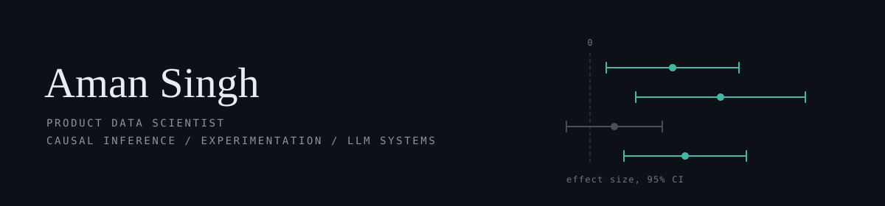

  <picture>
    <source media="(prefers-color-scheme: dark)" srcset="header-dark.svg">
    <source media="(prefers-color-scheme: light)" srcset="header-light.svg">
    
  </picture>

  
  
  

 

Most of my work comes down to one question: did this actually change anything?

That usually means running experiments, and when an experiment isn't possible, working with observational data and being upfront about what it can't tell you. The rest of the time I'm building the thing being measured, mostly ranking and recommendation systems and the pipelines that keep a model working once it's live.

Right now I'm interested in getting LLMs to handle the tedious parts of analysis.

 

### Stack

**Core**
 

**Data and ML**
 

**LLM and serving**
 

**Data platform and infra**
 

 

Open to talking about experiment design, metric frameworks, and causal inference. Reach me at <a href="mailto:singhaman0524@gmail.com">singhaman0524@gmail.com</a>.
